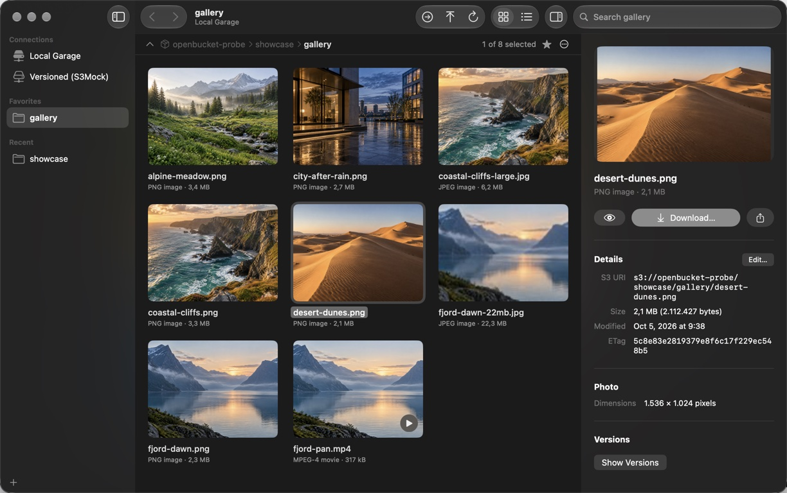
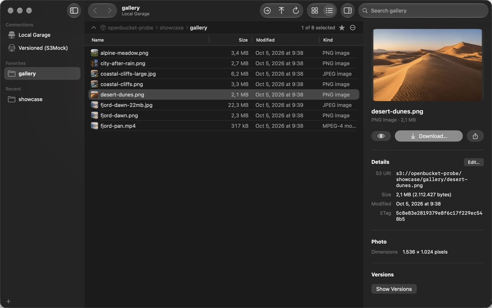
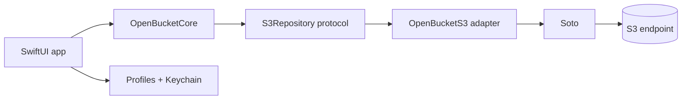

<div align="center">


# OpenBucket

**A native S3 browser for macOS. See your objects, inspect media, and download what you need.**


</div>

OpenBucket is an early macOS app for Amazon S3 and S3-compatible object stores. Every connection is read-only until you turn on **Allow changes** for it. It uses SwiftUI, the macOS 26 Liquid Glass appearance, and [Soto](https://github.com/soto-project/soto) behind a replaceable S3 adapter. It stays focused on S3 rather than adding unrelated file protocols.

## Download

Download the latest signed and notarized build from [GitHub Releases](https://github.com/raelsei/openbucket/releases/latest). Open the macOS DMG, drag OpenBucket to Applications, and launch it there. The release includes a SHA-256 checksum; the app supports Apple silicon and Intel Macs running macOS 26 or later. See [how releases are prepared](docs/RELEASING.md).

## See it in action

The screenshots show a real OpenBucket window connected to a local Garage bucket with the [included demo objects](#demo-data).





## What works

| Area | Current behavior |
| --- | --- |
| Connections | Multiple profiles, custom HTTP or HTTPS endpoints, region and addressing style, access keys with an optional session token or a named AWS CLI profile (static keys, roles, IAM Identity Center after `aws sso login`) |
| Restricted accounts | Open a known bucket without account-wide `ListBuckets` permission; start in a chosen folder |
| Browsing | Grid and sortable native table, breadcrumb path, folder navigation, `s3://` links (also opened from other apps) and S3 console URLs in Go to Location, favorites and recent folders per connection, filter and search below the current folder, refresh, incremental `ListObjectsV2` loading |
| Selection and commands | Native multi-selection in grid and list (⌘A, ⇧-click, ⌘-click); menu commands and shortcuts for the enclosing folder (⌘↑), back and forward (⌘[ ⌘]), grid and list (⌘1 ⌘2), Find (⌘F) and the Info panel (⌥⌘I); context menus; Copy S3 URI |
| Media and details | Image and video thumbnails with a Show Previews toggle; Quick Look with Space or ⌘Y; inline video playback; HEAD details, user metadata, tags and photo EXIF in the Info panel |
| Versions | Version history per file with Quick Look, download and restore; Show Deleted Files (⇧⌘.) and Browse As Of a date on versioned buckets |
| Downloads and links | File, batch and whole-folder downloads with byte progress, cancellation and failed-key reporting; drag files out to Finder; presigned share links (15 minutes to 7 days) with QR code |
| Changes | With **Allow changes** on: upload files and folders (⌘U, toolbar or Finder drop; large files in multipart parts), New Folder (⇧⌘N), rename, Move To or drag items onto a folder or a parent in the path bar, Delete (⌘⌫), restore versions and deleted files, edit content headers, metadata and tags. Existing names prompt Replace, Keep Both or Skip |
| Insight | Storage Overview: treemap of a folder by size and kind, storage classes and largest files. Compare with Local Folder: checks a local copy against S3 by size and checksum without changing either side |
| Shortcuts | App Intents for opening a favorite or an `s3://` location and copying a share link; favorites appear in Spotlight |
| Secrets | Access keys and session tokens in macOS Keychain; non-secret connection settings in a user-only profile file |

Sync, Finder mounting, bucket management, permanent deletion of individual versions and non-S3 protocols are outside this preview. [Compatibility details](docs/compatibility.md) document endpoint paths, the S3 operations used, and provider test status; [security details](docs/security.md) explain local storage, temporary files, and what changes S3.

## Connect to S3

After installing the app:

1. Choose **Add Connection**.
2. Enter the S3 endpoint URL and region. For a custom service such as Garage, choose **Path style** if its buckets live beneath the endpoint path.
3. Enter an access key and secret. Set **Known bucket** when the key cannot list all buckets. **Starting folder** is optional and opens a folder inside that bucket.
4. Test the connection, save it, and browse. Use the toolbar's location action to jump directly to `s3://bucket/folder/`. To upload or change files, edit the connection and turn on **Allow changes**.

The endpoint URL path and the starting folder are separate. For example, endpoint `https://store.example.com/s3/`, known bucket `photos`, and starting folder `2026/travel/` address objects under the bucket without dropping `/s3/` from the signed request. A proxy must preserve the signed request path. See [endpoint behavior](docs/compatibility.md#endpoint-paths).

## Demo data

The repository includes six small demo objects in [`docs/demo-assets/travel`](docs/demo-assets/travel) and an opt-in [seed script](scripts/seed-demo.sh). It uploads them to a **bucket you specify**, under `openbucket-demo/travel/` by default; set `OPENBUCKET_DEMO_PREFIX` to choose another isolated prefix. The script needs `curl` with SigV4 support and these environment variables:

| Variable | Example or purpose |
| --- | --- |
| `OPENBUCKET_DEMO_ENDPOINT` | `http://127.0.0.1:3900` |
| `OPENBUCKET_DEMO_REGION` | `garage` or your provider's region |
| `OPENBUCKET_DEMO_BUCKET` | An existing bucket you can write to |
| `OPENBUCKET_DEMO_ACCESS_KEY` | Access key ID |
| `OPENBUCKET_DEMO_SECRET_KEY` | Secret access key |
| `OPENBUCKET_DEMO_PREFIX` | Optional destination prefix |

After setting them in your shell, run `scripts/seed-demo.sh` and open the printed `s3://` location in OpenBucket. The script replaces any objects with the same six names under that prefix, so use a disposable location. Credentials and local profile files are never part of the repository. The README screenshots use `gallery/` in an isolated local Garage fixture.

## Build and test

Building from source requires **macOS 26 or later** and **Xcode 27**. Open `OpenBucket.xcodeproj`, select the `OpenBucket` scheme, and run it on your Mac. The Xcode project is committed; [XcodeGen](https://github.com/yonaskolb/XcodeGen) is needed only after changing `project.yml`:

```sh
xcodegen generate --spec project.yml
```

```sh
swift format lint --strict --recursive App AppTests Packages/OpenBucket/Sources Packages/OpenBucket/Tests
xcodebuild test -project OpenBucket.xcodeproj -scheme OpenBucket -destination 'platform=macOS' -derivedDataPath DerivedData -disableAutomaticPackageResolution CODE_SIGNING_ALLOWED=NO
swift test --package-path Packages/OpenBucket
```

Unit tests need no AWS account. The optional live S3 test uses an isolated bucket and environment variables documented in [compatibility testing](docs/compatibility.md#live-compatibility-test). GitHub Actions runs the format check, app tests, package tests, and a check that the committed Xcode project matches `project.yml` on an Xcode 27 runner.

## How the code is organized



`OpenBucketCore` owns S3 values and browsing state. `OpenBucketS3` adapts Soto and keeps SDK types outside the UI. `App` contains SwiftUI and macOS storage; `OpenBucketApp` wires them together. The adapter boundary allows the SDK implementation to change without reshaping the browser.

Contributions are welcome; read [CONTRIBUTING.md](CONTRIBUTING.md). OpenBucket is licensed under [MIT](LICENSE).
